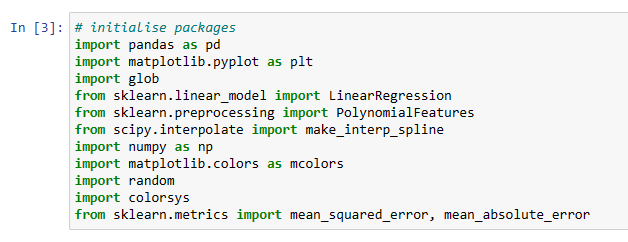
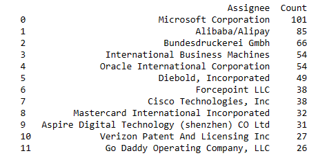

<!-- PROJECT LOGO -->
<br />
<div align="center">
    

  <h3 align="center">Mining Digital Identity Insights: Patent Analysis using NLP</h3>

  <p align="center">
    A repository with reproducibility package to accompany the published article
    <br />

  </p>
</div>


<!-- ABOUT THE PROJECT -->
## About The Project

<p>The field of digital identity innovation has grown significantly over the last 30 years, with over 6,000 technology patents registered worldwide. However, many questions remain about who controls and owns our digital identity and intellectual property and, ultimately, where the future of digital identity is heading.
</p>
<p>To investigate this further, this research mines digital identity patents and explores core themes such as identity, systems, privacy, security, and emerging fields like blockchain, financial transactions, and biometric technologies. Utilizing natural language processing (NLP) methods, including part-of-speech tagging, clustering, topic classification, noise reduction, and lemmatisation techniques. Finally, the research employs graph modelling and statistical analysis to discern inherent trends and forecast future developments.</p>

<p>The findings significantly contribute to the digital identity landscape, identifying key players, emerging trends, and technological progress. This research serves as a valuable resource for academia and industry stakeholders, aiding in strategic decision-making and investment in emerging technologies and facilitating navigation through the dynamic realm of digital identity technologies. </p>

<!-- Use the `BLANK_README.md` to get started.-->

<p align="right">(<a href="#readme-top">back to top</a>)</p>


<!-- GETTING STARTED -->
## Getting Started

This is an example of how you may give instructions on setting up your project locally.
To get a local copy up and running follow these simple example steps.

### Prerequisites
The following prerequistes are required:
1. [Jupyter notebook](https://jupyter.org/)
2. [Python](https://www.python.org/)
3. Python packages: </br>


<!-- USAGE EXAMPLES -->
## Usage

In this section we will outline key commands used for the analysis. Note that more comments are available in the notebook itself

### Patent Analysis Notebook
1. Output Patent Leaders </br>
   The following command will output the top 12 entities by patent count over the given dataframe
   ```sh
   output_leaders(wd)
   ```
   
2. Display Entity </br>
   This code will display patent counts for the entire dataset, period 1996-2020 and post 2020. In addition it will output the first and last patents within the dataframe
   ```sh
   display_entity(wdfull, "Diebold", [], [])
   ```
3. Display Entity with Keywords </br>
   This code will display patent count metrics for each of the provided key term search words
   ```sh
   display_entity(wdfull, "Diebold", ["privacy","trust"], [])
   ```
4. Display Entity with Additional Ranges
   ```sh
   display_entity(wdfull, "Microsoft", ["transaction", "game", "privacy", "trust"], [("Kim Cameron", 1999, 2011, [])])
   ```
5. Output Patents for Entity
   ```sh
   print_all_patents(wdfull, "Microsoft")
   ```
### Patent Modeling Notebook
1. Model Keywords
   ```sh
   output_leaders(wd)selected_words = {'certificate','storage','privacy','communication','encryption'}  # Example set of words colors = generate_dark_colors(len(selected_words)) plot_graph(selected_words, 'TF-IDF','Security',3, -0.00002)
   ```
<p align="right">(<a href="#readme-top">back to top</a>)</p>


<!-- CONTACT -->
## Contact

Matthew Comb - matthew.comb@linacre.ox.ac.uk

Project Link: [https://github.com/oxford-mc/patent-mining](https://github.com/oxford-mc/patent-mining)

<p align="right">(<a href="#readme-top">back to top</a>)</p>


<!-- ACKNOWLEDGMENTS -->
## Acknowledgments

* [Commonwealth Scholarship Commission in the UK](https://cscuk.fcdo.gov.uk/)
* [Department of Computer Science, University of Oxford](https://www.cs.ox.ac.uk/)

<p align="right">(<a href="#readme-top">back to top</a>)</p>


<!-- MARKDOWN LINKS & IMAGES -->
<!-- https://www.markdownguide.org/basic-syntax/#reference-style-links -->
[contributors-shield]: https://img.shields.io/github/contributors/othneildrew/Best-README-Template.svg?style=for-the-badge
[contributors-url]: https://github.com/othneildrew/Best-README-Template/graphs/contributors
[forks-shield]: https://img.shields.io/github/forks/othneildrew/Best-README-Template.svg?style=for-the-badge
[forks-url]: https://github.com/othneildrew/Best-README-Template/network/members
[stars-shield]: https://img.shields.io/github/stars/othneildrew/Best-README-Template.svg?style=for-the-badge
[stars-url]: https://github.com/othneildrew/Best-README-Template/stargazers
[issues-shield]: https://img.shields.io/github/issues/othneildrew/Best-README-Template.svg?style=for-the-badge
[issues-url]: https://github.com/othneildrew/Best-README-Template/issues
[license-shield]: https://img.shields.io/github/license/othneildrew/Best-README-Template.svg?style=for-the-badge
[license-url]: https://github.com/othneildrew/Best-README-Template/blob/master/LICENSE.txt
[linkedin-shield]: https://img.shields.io/badge/-LinkedIn-black.svg?style=for-the-badge&logo=linkedin&colorB=555
[linkedin-url]: https://linkedin.com/in/othneildrew
[product-screenshot]: images/screenshot.png
[Next.js]: https://img.shields.io/badge/next.js-000000?style=for-the-badge&logo=nextdotjs&logoColor=white
[Next-url]: https://nextjs.org/
[React.js]: https://img.shields.io/badge/React-20232A?style=for-the-badge&logo=react&logoColor=61DAFB
[React-url]: https://reactjs.org/
[Vue.js]: https://img.shields.io/badge/Vue.js-35495E?style=for-the-badge&logo=vuedotjs&logoColor=4FC08D
[Vue-url]: https://vuejs.org/
[Angular.io]: https://img.shields.io/badge/Angular-DD0031?style=for-the-badge&logo=angular&logoColor=white
[Angular-url]: https://angular.io/
[Svelte.dev]: https://img.shields.io/badge/Svelte-4A4A55?style=for-the-badge&logo=svelte&logoColor=FF3E00
[Svelte-url]: https://svelte.dev/
[Laravel.com]: https://img.shields.io/badge/Laravel-FF2D20?style=for-the-badge&logo=laravel&logoColor=white
[Laravel-url]: https://laravel.com
[Bootstrap.com]: https://img.shields.io/badge/Bootstrap-563D7C?style=for-the-badge&logo=bootstrap&logoColor=white
[Bootstrap-url]: https://getbootstrap.com
[JQuery.com]: https://img.shields.io/badge/jQuery-0769AD?style=for-the-badge&logo=jquery&logoColor=white
[JQuery-url]: https://jquery.com 
